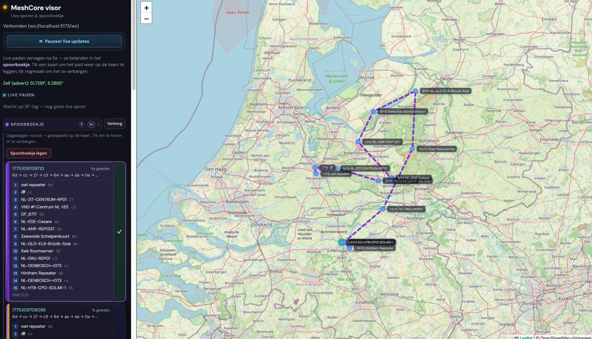

# MeshCoreBot

MeshCoreBot is a companion for MeshCore. It connects over **USB serial** or **TCP** using the same framing as MeshCore `ArduinoSerialInterface`:

- **Send:** `<` + u16 LE length + payload  
- **Receive:** `>` + u16 LE length + payload  

It also runs an embedded **visor**: an HTTP server with a **Vue** frontend and **WebSocket** that shows RF routes live and infers paths from the RF log (`0x88`) plus contact and position data.

[](images/image.png)

## Features

### Bot

- Connects to the radio via serial or TCP (environment variables).
- Periodic `GET_MESSAGE` polling (configurable).
- Optional verbose logging of all companion packets (`MESHCORE_LOGALL`).
- Replies to trigger words on the same channel (e.g. `Test`, `ping`, `echo`, `ontvang`; see code).
- Optional: visor only, no bot logic (`MESHCORE_BOT_DISABLED`).

### Visor (map & routes)

- HTTP on `MESHCORE_VISOR_PORT` (default **3847**): static frontend, health at `/health`, WebSocket at **`/ws`**.
- **Live routes:** path hops are parsed from `PKT_LOG_RX_DATA` (`0x88`); coordinates are inferred (`geo_path`) using the contact book and own position (`0x05` self-info).
- **Contacts:** bootstrap and periodic sync from the MeshCore map API (`MESHCORE_MAP_NODES_URL`); companion contact frames (`0x03` / `0x8A`) augment the contact book.
- WebSocket messages include `type: "contacts"` (own position, index count) and `type: "route"` (hops, coords, hop steps with names where available).

### Frontend (Vue + Leaflet)

- Live polyline on the map; after a TTL the trace moves to the **logbook** (archive).
- Logbook: pagination (10 traces per page), route id shown as a **UTC ISO timestamp** (source: server millisecond epoch id).
- **IndexedDB:** archived traces persist locally in the browser (database `meshcore-visor`, object store `spoorboekje`, key `entries`).
- Pause control to temporarily ignore live WebSocket updates.

## Path inference algorithm

The RF log carries an ordered list of **hop identifiers** (hex prefixes, 1–4 bytes as 2–8 hex digits). The contact book maps each hop to zero or more **contacts** (from the map API and companion `PACKET_CONTACT` / advert updates). Each contact may have **GPS** (`lat`/`lon`). The algorithm (`src/geo_path.rs`, `infer_route_lon_lat`) assigns one **(lon, lat)** per hop in packet order for drawing the polyline.

**Matching:** For each hop string, `contacts_for_hop_prefix` selects contacts whose `pubkey_prefix_hex` starts with that hop (or falls back to the first-byte hash if needed). All GPS coordinates of those matches are **candidates** for that hop.

**RF plausibility:** Consecutive inferred points must lie within **`MAX_DIRECT_HOP_KM` (60 km)** great-circle distance (Haversine). Links longer than that are rejected when choosing candidates.

### When own position is known (`PKT_SELF_INFO` → `self_pos`)

1. **Primary (strict, backward):** Walk hops **from last hop toward the first** (reverse of packet order). Start from **your own (lon, lat)**. For each hop, among its GPS candidates pick the one **nearest** to the current reference point **within 60 km**; that point becomes the next reference. The result is the hop list in **original packet order** (the vector is reversed after building).
2. If any hop has no candidate within 60 km (or no GPS at all), strict mode fails.
3. **Relaxed (backward):** Same as above, but if a hop has no valid GPS, a **synthetic** point is placed using a small deterministic offset from the previous point (`synth_step`, depends on hop index and hop hex byte) so the chain still completes.

### When own position is unknown

1. **Strict (forward + DP):** Every hop must have at least one matching contact and at least one GPS candidate. A **path anchor** is a rough centroid: mean of “first GPS seen per hop” (default fallback ~Netherlands if nothing is found). A **dynamic program** (`dp_segment`) picks one candidate per hop to **minimize the sum of segment lengths** (shortest total path), subject to each hop’s first segment from the anchor and each inter-hop segment being ≤ 60 km. This is a Viterbi-style shortest-chain over the candidate grid.
2. If strict fails, **relaxed (forward):** start from the same anchor; for each hop in order, take the GPS candidate **nearest** to the previous point within 60 km, otherwise **synthesize** a point.

**Post-processing:** `spread_degenerate_coords` nudges nearly collinear or identical coordinates so the map line is visible.

**UI labels:** For each hop’s inferred point, the visor picks the contact name whose GPS is **closest** to that point among prefix matches (`contact_for_inferred_point`), so names stay consistent with the geometry when several contacts share a prefix.

## Building and running the frontend

### Production (what the Rust binary expects)

The visor serves files from **`frontend/dist`** unless you set `MESHCORE_FRONTEND_DIST`.

```sh
cd frontend
npm install
npm run build
```

Then from the repo root:

```sh
cargo run --release
```

Open in the browser: `http://127.0.0.1:3847/` (or your `MESHCORE_VISOR_PORT`). The WebSocket is `ws://127.0.0.1:3847/ws` on the same host and port as the page.

### Development (hot reload + proxy)

1. Start the bot/visor so `/ws` is available, for example:  
   `MESHCORE_TCP=192.168.10.32:5000 cargo run`
2. In a second terminal:

```sh
cd frontend
npm install
npm run dev
```

Vite proxies `/ws` to the visor on `127.0.0.1` — port via **`VITE_VISOR_PORT`** in `frontend/.env` (default **3847**, see `vite.config.js`). Open the URL Vite prints (usually `http://localhost:5173`).

### Frontend environment (Vite)

| Variable | Meaning |
|----------|---------|
| `VITE_VISOR_PORT` | Port of the running visor for the **dev proxy** to `/ws` (default `3847`). |
| `VITE_VISOR_WS_URL` | Optional: full WebSocket URL (e.g. `wss://example.com/ws`). If set, the app uses it instead of `ws://<current host>/ws`. |

## Configuration (environment variables)

### Connection (one of two)

| Variable | Description |
|----------|-------------|
| `MESHCORE_SERIAL` | Path to USB serial (e.g. `/dev/ttyACM0`). Required if `MESHCORE_TCP` is not set. |
| `MESHCORE_BAUD` | Serial baud rate (default `115200`). |
| `MESHCORE_TCP` | `host:port` for TCP; if set, serial is ignored. |

### Bot behaviour

| Variable | Description |
|----------|-------------|
| `MESHCORE_POLL_SECS` | `GET_MESSAGE` polling interval in seconds (default `3`). |
| `MESHCORE_LOGALL` | Non-empty: log all companion packets in/out (stderr). |
| `MESHCORE_REPLY_TEXT` | Location line in replies (default `Den Bosch Noord`). |
| `MESHCORE_BOT_DISABLED` | Non-empty: disable channel triggers/replies; visor keeps running. |

### Visor & static frontend

| Variable | Description |
|----------|-------------|
| `MESHCORE_VISOR_PORT` | HTTP + WebSocket port (default `3847`). |
| `MESHCORE_FRONTEND_DIST` | Path to built frontend (default `frontend/dist`). |

### Map API & contact sync

| Variable | Description |
|----------|-------------|
| `MESHCORE_MAP_NODES_URL` | Nodes API URL (default `https://map.meshcore.io/api/v1/nodes?binary=0&short=1`). |
| `MESHCORE_MAP_FETCH_TIMEOUT_SECS` | HTTP fetch timeout to the map API in seconds (default `1000`). |
| `MESHCORE_CONTACT_SYNC_SECS` | Interval to reload the map API in seconds (default `300`). |

## Building (Rust)

```sh
cargo build --release
```

Binary: `target/release/meshcorebot`.

## License

This project is licensed under the GNU Lesser General Public License (LGPL) v3.0 or later.

```
This program is free software: you can redistribute it and/or modify
it under the terms of the GNU Lesser General Public License as published by
the Free Software Foundation, either version 3 of the License, or
(at your option) any later version.

This program is distributed in the hope that it will be useful,
but WITHOUT ANY WARRANTY; without even the implied warranty of
MERCHANTABILITY or FITNESS FOR A PARTICULAR PURPOSE.  See the
GNU Lesser General Public License for more details.

You should have received a copy of the GNU Lesser General Public License
along with this program.  If not, see <https://www.gnu.org/licenses/>.
```
